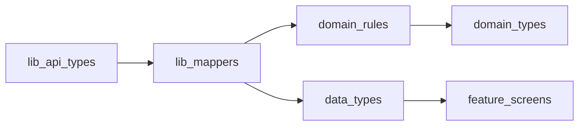

# MobileUI Architecture

`MobileUI` is organized around expense-tracking domains rather than screens. Route files in `app/` are adapters: they mount navigation, providers, or feature screen containers. Domain rules live in `domain/` and feature modules under `features/`.

## Boundaries

- `app/`: Expo Router files only. Keep route files thin.
- `features/<domain>/`: screen containers, domain-specific components, hooks, validation, and constants.
- `components/ui/`: reusable, domain-neutral UI primitives.
- `components/layout/`: shared app layout/provider composition.
- `domain/`: money, dates, transaction, budget, and model rules that must stay consistent across features.
- `lib/api/`: HTTP client, DTOs, API bootstrap, and endpoint clients.
- `lib/query.ts`: query keys and cache invalidation rules.

## Screen Shell Contract

Every stack screen follows the same layout shell for consistent safe-area handling, spacing, and navigation chrome.

```
Screen (or Screen padded={false} + inner padding)
  └── ScreenHeader (title, onBack, optional rightAction; variant="close" for modals)
  └── ScreenScrollView / ScrollView / content sections
        └── SectionHeader (title, optional action)
        └── Card / SeparatedList / MetricCard
```

**Rules:**

- Stack screens use `Screen` + `ScreenHeader`. Auth/onboarding entry screens use `Screen` only (no header).
- Tab screens (Dashboard, Budget, AI, Profile) use `ScreenScrollView` without `ScreenHeader` but still use `SectionHeader`, `Card`, and `MetricCard`.
- Safe-area padding is owned by `Screen` / `ScreenScrollView` via `useScreenInsets`. Feature screens must not call `useSafeAreaInsets()` directly.
- Preserve stable `testID`s through refactors (`screen-back-btn`, tab labels, primary CTAs).

## Type Layers

Use a documented three-layer type model. Do not mix layers in screens.

| Layer | Location | Responsibility |
|-------|----------|----------------|
| API DTOs | `lib/api/types.ts` | Raw server shapes |
| Domain | `domain/types.ts` + `domain/*.ts` | Business rules, `Money`, budget metrics, validation |
| View models | `data/types.ts` | UI-ready shapes with display fields (`icon`, `iconBg`, formatted strings) |

**Mapping flow:** `API DTO → domain (mappers) → view model (mappers) → screen`

- `IconName` lives in `domain/types.ts` (shared by domain and view-model layers).
- `data/types.ts` re-exports `IconName` for convenience but must not define domain types.
- Expand `lib/mappers.ts` to produce view models from domain types where calculations matter.



## Async State Contract

Data-fetching screens must handle all four query states explicitly:

1. **Loading** — render `ScreenLoading` (full screen, outside shell when appropriate).
2. **Error** — render `ErrorState` with retry wired to `refetch()`.
3. **Empty** — render `EmptyState` when data is an empty collection.
4. **Content** — render the `Screen` shell and feature UI.

**Pattern:**

- React Query hooks expose `data | isLoading | isError | error | refetch`.
- Prefer `useQueryScreenState` and `QueryScreenBoundary` for shared state wiring.
- Never leave a screen in infinite loading when the query has failed.
- Mutation buttons must guard against double-submit (`disabled={mutation.isPending}`).

## Mobile Standards

- Money values are formatted through `domain/money` or `lib/format`, never ad hoc in screens.
- Budget and date-period calculations are centralized in `domain/budget` and `domain/dates`.
- Money-mutating actions must protect against double submits and refresh affected dashboard, transactions, budget, accounts, insights, and notifications state where relevant.
- Sensitive data such as tokens, receipts, transcripts, and raw financial payloads must not be logged in production.
- Voice and AI expense flows must keep a user confirmation/correction step before creating financial records.
- Shared UI primitives must be theme-aware, accessible, and independent of expense-tracking domain concepts.
- No hardcoded hex colors in `features/` — use `useColors()` and `constants/theme.ts` tokens.
- No business math in screens — budget, money, and date calculations go through `domain/`.

## PR Checklist for New Screens

Before merging a new or refactored screen:

- [ ] Route file in `app/` is a thin re-export or gate only.
- [ ] Screen uses `Screen` / `ScreenScrollView` + `ScreenHeader` (or `Screen` only for auth/onboarding).
- [ ] Loading, error, empty, and content states are all handled.
- [ ] Mutation/submit buttons disable while `isPending`.
- [ ] Amounts use `formatCurrency` / `domain/money`; dates use `domain/dates`.
- [ ] Colors and spacing use `useColors()`, `constants/theme.ts` — no feature-level hex literals.
- [ ] Screen file stays under ~300 lines; extract sections into `features/<domain>/components/`.
- [ ] `testID`s preserved for E2E specs.
- [ ] `npm run typecheck` and `npm run lint` pass in `MobileUI/`.

## File Size Guideline

- Screen orchestrators: **< 300 lines**
- Feature components: focused, single-responsibility
- When a screen grows beyond the limit, extract modals, rows, and sections into `features/<domain>/components/`
